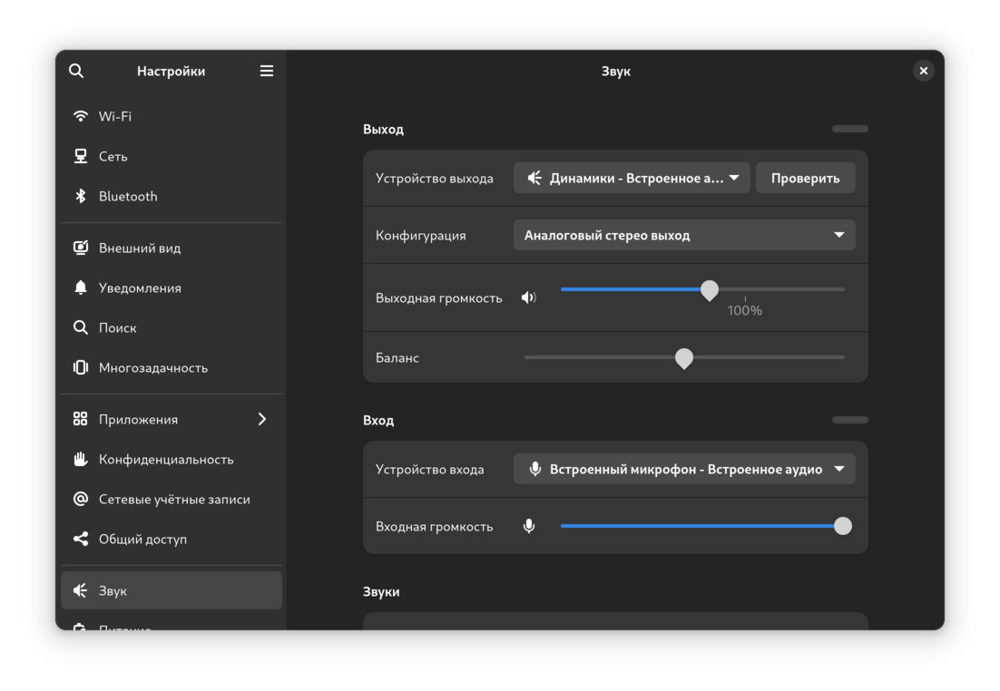

# Управление громкостью в Gnome

## Установка уровня громкости

Уровень громкости в системе возможно изменить несколькими способами:

- Через GUI в меню (уточнить как называется) в ползунке поменять выбранную позицию
  
- Через GUI в приложении "Настройки" > "Звук"


- Через TUI в приложении `alsamixer`

- Через CLI в терминале:

::: code-group

```shell[wireplumber]
# Установить уровень громкости в 70%
pwctl set-volume @DEFAULT_AUDIO_SINK@ 0.7
# или 
# Увеличить на 5%, с установкой ограничения в 150%
pwctl set-volume -l 1.5 @DEFAULT_AUDIO_SINK@ 5%+
```

:::

## Включение уровня громкости > 100%

Хоть это и не рекомендуется в большинстве случаев сообществом докторов
но бывают такие моменты когда требуется громкость с уровнем более 100%
и если в текущий момент настройка не доступна, ее можно включить через
приложение `Редактор dConf` который доступен на панели приложений.

Для включения этой опции достаточно:

- Открыть приложение `Редактор dConf` кликнув по иконке:\

  
- Воспользоваться строкой поиска и набрать в ней фразу `volume`\


- В появившихся настройках включить галку у `org.gnome.desktop.sound` в положение включено.
- Закрыть редактор

- Если все сделано правильно, то в приложении "Настройки" можно наблюдать следующую картину\

